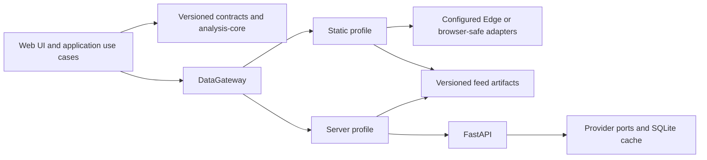

# Stock Analysis 个人研究工作台整体重构设计

- Status: Draft for written review; design sections approved in conversation
- Date: 2026-07-16
- Scope: repository-wide architecture, migration, testing, security, and documentation
- Baseline commit: `3fe79bfc748e83b6f9ee16e17fe75bf11ceddadc`

## 1. Decision summary

The product will be a personal research and self-hosted multi-market stock intelligence workbench.

Two runtime profiles are first-class:

1. Static profile: GitHub Pages or another static host, with optional Edge endpoints, published feed artifacts, browser-safe providers, and local cache.
2. Server profile: Next.js plus FastAPI, with server-side providers, cache, and the same published feed contracts.

The profiles must provide the same core semantics, contracts, calculations, and user experience. They may use different data sources or degrade differently, but every result must expose its source, timestamp, freshness, cache state, and fallback status.

The migration will preserve user-visible features while allowing internal breaking changes. Existing routes, API paths, feed URLs, and CLI entry points remain available through compatibility adapters until their replacements pass the agreed retirement gates.

The selected migration strategy is a contract-first strangler refactor. It replaces vertical slices incrementally instead of rebuilding the entire platform in parallel or performing unstructured file-by-file cleanup.

## 2. Context and problem statement

The repository currently combines four systems:

- a Next.js static and Edge-capable frontend;
- an optional FastAPI market-data service;
- GitHub Actions and Git-backed feed publication;
- Python research, backtesting, and automation scripts.

The system is useful, but its boundaries are not explicit:

- quote and OHLCV requests can traverse FastAPI, Edge routes, raw GitHub artifacts, browser providers, and local caches in different orders;
- indicators and Chan analysis are duplicated across TypeScript, backend Python, and automation Python and have already diverged;
- provider mapping, symbol normalization, caching, and fallback rules are repeated;
- feed artifacts have multiple writers, uneven schemas, non-transactional publication, and unclear ownership;
- scripts and backtests share code through path manipulation rather than a stable Python package;
- current-state documentation, historical experiment notes, and target architecture are mixed together.

The refactor must correct these issues without suspending the existing dashboard or automated jobs.

## 3. Goals and non-goals

### 3.1 Goals

- Keep the product useful throughout the migration.
- Make static and server profiles equally supported release targets.
- Establish one versioned contract for symbols, quotes, OHLCV, analysis results, source metadata, and feed artifacts.
- Make user-visible deterministic technical analysis use one implementation.
- Separate data acquisition, application use cases, domain calculations, storage, publication, and presentation.
- Make every fallback and stale-data decision observable.
- Give feed publication one validated and atomic write path.
- Make research and automation import a real Python package.
- Add a CI matrix that proves both runtime profiles and core semantic parity.
- Replace the root README with a concise, truth-first entry point.

### 3.2 Non-goals

- Building a multi-user SaaS, authentication, billing, or account management.
- Adding brokerage execution or presenting the product as a trading system.
- Requiring Redis, PostgreSQL, TimescaleDB, object storage, or Kubernetes for the default installation.
- Rewriting all research code into TypeScript.
- Reproducing every historical experiment during the architecture migration.
- Rewriting Git history to remove existing generated artifacts.
- Guaranteeing that different upstream providers return identical market values.

## 4. Alternatives considered

### 4.1 Contract-first strangler refactor — selected

Introduce contracts, fixtures, gateways, and compatibility facades, then migrate quote, OHLCV, analysis, feed, and pages as vertical slices.

Benefits:

- both runtime profiles remain deployable;
- each slice can be tested and rolled back independently;
- user-facing compatibility can outlive internal breaking changes;
- automated jobs do not need to stop.

Cost:

- old and new boundaries temporarily coexist;
- retirement requires disciplined parity tests and an explicit deletion ledger.

### 4.2 Parallel V2 rebuild — rejected

A clean V2 tree would reduce inherited structure, but the repository would have two active implementations for a long period. Feature omissions, feed drift, and cutover risk would be high.

### 4.3 In-place file cleanup — rejected

Splitting large files without introducing contracts and ownership boundaries would reduce file size while preserving the underlying duplication and source ambiguity.

## 5. Target architecture

The governing rule is: one product, two runtime profiles, one domain vocabulary.



### 5.1 Runtime selection

Runtime selection occurs once during application bootstrap. Pages and use cases receive a configured DataGateway; they do not inspect deployment variables or branch on provider type.

The static profile uses this centralized priority:

1. configured Edge adapter, when enabled, capable of the request, and fresh enough;
2. a published feed artifact, when that capability is available and fresh enough;
3. a browser-safe direct provider;
4. the freshest permissible stale candidate from those adapters or local cache.

The server profile uses:

1. a fresh FastAPI result;
2. a published feed artifact that satisfies the request freshness policy;
3. the freshest permissible stale FastAPI, feed, or server-cache candidate.

The gateway retains stale candidates while continuing the fresh-data search. If no fresh result succeeds, it chooses the freshest candidate allowed by the request policy rather than accepting the first stale response.

An unset endpoint disables its adapter. There is no hidden default production URL.

### 5.2 Contract authority

JSON Schema is the canonical cross-language contract format. TypeScript types and Pydantic models are generated from the schemas and are not hand-maintained in parallel.

The contract set includes:

- Symbol and market identifiers;
- Quote;
- OHLCV series and intervals;
- DataEnvelope and SourceMeta;
- analysis input and output;
- FeedArtifact and FeedManifest;
- typed error payloads.

Breaking contract changes increment the major schema version. Readers may support the current and immediately previous major version during a migration, but writers emit only the current version.

### 5.3 Analysis authority

Pure, deterministic, OHLCV-derived user-facing calculations live in a framework-independent TypeScript analysis-core package. It has no React, fetch, storage, clock, or environment dependencies.

The browser uses analysis-core in both runtime profiles. FastAPI does not remain a competing authority for indicators, deterministic signals, or Chan calculations. Existing analysis endpoints remain compatibility facades during migration and are then retired.

Batch workflows that need the exact same user-facing calculations invoke an analysis CLI built from analysis-core. They do not reimplement the formulas in Python.

Python remains authoritative for research and backtesting methods that are not interactive dashboard semantics. Any research result exposed in the UI carries a distinct method ID, method version, data cutoff, and input identity. Provider-specific order-book or trade aggregation remains owned by the relevant data adapter and is not represented as a generic OHLCV calculation.

### 5.4 Persistence

SQLite remains the default cache and bar-store implementation for self-hosting. PostgreSQL is an optional adapter or projection and is not required for static or basic server operation.

Personal watchlists, alerts, and preferences remain local-first and retain import/export compatibility. Server persistence for those settings is outside this refactor.

## 6. Components and dependency boundaries

The migration initially keeps the existing top-level frontend, backend, scripts, and backtest directories. Directory renaming is not an early milestone because it creates risk without correcting ownership.

The target logical structure is:

```text
contracts/
  schemas/
  fixtures/

packages/
  analysis-core/
  analysis-cli/

frontend/
  app/
  src/application/
  src/data/gateway.ts
  src/data/profiles/
  src/data/adapters/
  src/ui/

backend/
  app/api/
  app/application/
  app/ports/
  app/adapters/providers/
  app/adapters/storage/

python/
  stock_core/data/
  stock_core/research/
  stock_core/feed/

scripts/
backtest/
feed/
```

Component responsibilities:

- contracts owns schemas, generated-model inputs, compatibility rules, and golden fixtures;
- analysis-core owns deterministic interactive calculations;
- analysis-cli exposes analysis-core to automation without duplicating formulas;
- frontend application code owns use-case orchestration, not data transport or formulas;
- DataGateway owns the stable request interface;
- profiles own source priority and runtime-specific policy;
- adapters own transport, upstream mapping, and normalization at the boundary;
- FastAPI routes own HTTP delivery only;
- backend application services own quote, OHLCV, and search use cases;
- ports define provider and persistence capabilities;
- stock_core owns reusable Python data, research, and feed logic;
- scripts are thin CLIs;
- backtest contains experiments, configurations, and result production, not shared libraries;
- publisher is the only component allowed to write canonical feed artifacts.

Allowed dependency direction:

- UI to application to DataGateway, analysis-core, and contracts;
- FastAPI routes to application to ports to adapters;
- scripts and backtests to stock_core to publisher and contracts.

Forbidden dependencies:

- provider adapters importing storage implementations;
- pages calling upstream providers or constructing raw GitHub URLs;
- scripts and backtests mutating sys.path to import each other;
- jobs or research scripts writing canonical feed paths directly;
- manually maintained duplicate TypeScript and Python contract models.

## 7. Interactive data flow

A page submits a standard request such as QuoteRequest or OhlcvRequest. The injected gateway selects an adapter according to the runtime profile and requested capability.

Adapters normalize symbol form, market, timezone, numeric precision, interval, and OHLCV ordering before returning data.

Successful responses use DataEnvelope:

```text
DataEnvelope<T>
  data
  contract_version
  source.provider
  source.fetched_at
  source.market_time
  source.freshness
  source.cache_status
  source.fallback_depth
  warnings
```

Rules:

- an adapter that does not support a capability is skipped explicitly;
- OHLCV from different providers is not silently stitched;
- an intentional composite series sets composite to true and records provenance for every segment;
- analysis output includes the algorithm version and an input digest;
- the UI displays source and stale status and does not claim quote, last bar, and analysis are from one provider unless metadata proves it.

## 8. Feed publication

Jobs write to an isolated staging directory identified by run ID. They cannot publish directly.

```text
job
  -> staging/run-id
  -> schema, signature, path, size, and idempotency validation
  -> temporary artifact files
  -> atomic artifact replacement
  -> manifest written last
  -> publication transport
```

The manifest contains:

- run ID;
- generation timestamp;
- manifest schema version;
- artifact path, artifact schema version, SHA-256 digest, and size;
- producer and method metadata.

Readers fetch the manifest first and accept only artifacts listed by it. If a new snapshot is incomplete or invalid, they continue using the previous complete manifest.

External submissions require a valid HMAC signature. Artifact IDs use an allowlisted character set. Before any write, the resolved destination must remain inside the approved root. Publication stages only the manifest allowlist and never performs a broad git add over the entire feed tree.

The current main-branch feed remains available during migration. The target low-cost operational transport is a dedicated data branch for generated artifacts, with main retaining contracts, fixtures, and documentation. This stops new generated-data churn in source history without rewriting existing Git history. Static and server profiles read the same configured manifest endpoint.

## 9. Error handling and observability

The shared error categories are:

- INVALID_REQUEST;
- UNSUPPORTED;
- RATE_LIMITED;
- UPSTREAM_FAILED;
- CONTRACT_MISMATCH;
- STALE_ONLY.

Errors include whether they are retriable, an optional retry-after value, the attempted sources, and a safe user-facing message.

Only rate limits, timeouts, and upstream failures trigger provider failover. Invalid symbols and contract mismatches do not cycle through providers to hide the fault.

STALE_ONLY is returned when stale candidates exist but the request forbids stale data. If the request permits stale data, the gateway returns a successful DataEnvelope with freshness marked stale and a warning instead of returning STALE_ONLY.

The UI degrades individual components instead of blanking an entire page. It shows the active source, stale timestamp, retry state, or unsupported capability. Empty catch blocks are forbidden.

Server mode centralizes circuit breakers, single-flight, cache policy, and provider health. Static mode applies adapter-scoped backoff and local caching. Both expose structured events sufficient to diagnose source selection and degradation.

## 10. Security requirements

The first implementation stage must address the known high-risk candidates before broader refactoring:

- repository dispatch IDs cannot escape the inbox or overwrite other feed paths;
- external OpenClaw artifacts fail closed when the HMAC secret is unavailable or invalid;
- feed validation cannot pass merely because an expected glob matched no files;
- publication uses a manifest allowlist rather than staging the entire feed tree;
- Dependabot cannot fall back to an unchecked direct merge;
- scheduled merge cleanup requires all required checks to be present, complete, and successful.

These requirements are verified by tests rather than documentation alone.

## 11. Test and release matrix

Every pull request runs:

1. Contract tests
   - schemas are valid;
   - TypeScript and Python generated types are current;
   - both languages accept the shared fixtures.
2. Analysis tests
   - indicators, signals, and Chan use fixed OHLCV fixtures;
   - floating-point tolerances are explicit;
   - analysis CLI and browser package return the same outputs.
3. Adapter tests
   - recorded fixtures cover mapping, timezone, rate limits, fallback, and stale data;
   - normal CI does not depend on live market networks.
4. Feed and security tests
   - traversal, invalid signature, duplicate ID, oversized payload, malformed manifest, interrupted publication, and previous-manifest fallback.
5. Static profile
   - lint, typecheck, unit tests, static build, and key-page smoke tests.
6. Server profile
   - the same frontend checks, server build, FastAPI tests, and end-to-end smoke tests.
7. Semantic parity
   - identical fixtures produce identical core page state and analysis results in both profiles.

Node 20 is pinned for development and CI. Python 3.11 is the primary runtime, with Python 3.12 compatibility tested. ESLint configuration, dependency declarations, deterministic installs, and a documented environment template are required.

The static build uses an explicit build profile and does not delete source directories. Edge handlers are packaged as a separate deployable transport from shared adapters, so the static Next tree contains no incompatible server routes.

## 12. Migration and retirement

### Stage 1: safety, baseline, and truthful documentation

- fix the dispatch, HMAC, feed-validation, and Dependabot risks;
- pin toolchains and repair dependency declarations;
- make current Python tests use their full declared validation dependencies;
- establish lint, typecheck, static build, server build, and route smoke tests;
- publish the new truth-first README and current-state documentation.

### Stage 2: contracts and dual-runtime gateway

- add schemas, generated models, and shared fixtures;
- introduce DataGateway and runtime profiles;
- convert the existing datasource module into a compatibility facade;
- migrate quote and OHLCV as the first vertical slices;
- remove hidden default endpoints.

### Stage 3: analysis, Python boundaries, and feed publisher

- extract analysis-core and analysis-cli;
- shadow-compare old and new analysis before switching;
- introduce stock_core and convert scripts to thin CLIs;
- introduce staged, validated, atomic manifest publication;
- move generated runtime artifacts away from main-branch source history.

### Stage 4: UI and repository cleanup

- split large pages into application controllers, selectors, and presentation components;
- consolidate research pipeline primitives;
- remove retired compatibility code, duplicated public feed snapshots, and obsolete documentation;
- keep the README and status documents aligned with the implemented state.

Each stage gets its own focused specification and implementation plan. This document is the program-level architecture decision, not a single giant execution plan.

### Retirement gates

An old implementation is removed only when:

- all known callers have migrated;
- static and server CI pass;
- compatibility-path telemetry or repository search shows no remaining use;
- the replacement has completed one full scheduled automation cycle;
- the rollback path and previous complete feed manifest are available.

The retirement ledger records old files, APIs, environment variables, workflows, replacements, and removal conditions.

### Rollback

- gateways and adapters use explicit configuration switches;
- each feed publication retains the previous complete manifest;
- a semantic mismatch fails the migration gate and keeps the old result active;
- security fixes are never rolled back to fail-open behavior;
- directory cleanup occurs only after functional rollback is no longer required.

## 13. README and documentation design

The root README is a truth-first entry point with:

1. one-sentence product positioning;
2. an explicit statement of what the product is and is not;
3. an Implemented, Optional, External, and Planned capability matrix;
4. equal static and server quick starts;
5. commands that are executed by CI;
6. data-source, freshness, estimation, and licensing limitations;
7. deployment matrix and repository map;
8. documentation navigation, compliance, and security reporting.

The README does not contain long iteration logs, transient backtest values, workflow counts, or target components presented as current.

Authoritative supporting documents:

```text
docs/current-architecture.md
docs/configuration.md
docs/deployment-matrix.md
docs/operations/workflows.md
docs/data-contracts/feed.md
docs/research/index.md
docs/rfcs/target-architecture.md
docs/archive/iteration-log.md
```

Every maintained document declares Status, Scope, and Last verified commit. The existing architecture document becomes a target-architecture RFC. Stale roadmaps are rewritten or archived. Backend, feed, and backtest READMEs describe only their subsystem installation, contracts, entry points, and limitations.

The first README rewrite describes the actual pre-refactor repository and links this design. Later stages update status only after implementation. Internal links, documented commands, and environment-variable names receive automated checks.

## 14. Acceptance criteria

The program succeeds when:

- a new user can choose either runtime profile from the root README and run the documented path without discovering an undocumented mandatory service;
- both profiles pass their release matrix and produce identical semantic outputs for shared fixtures;
- user-visible deterministic analysis has one implementation;
- every displayed market result exposes source and freshness metadata;
- no production feed artifact can bypass schema, signature where required, safe-path, and manifest validation;
- only the publisher writes canonical feed artifacts;
- FastAPI provider and storage dependencies point through ports rather than importing each other;
- scripts and backtests import stock_core without path mutation;
- main no longer accumulates routine-generated runtime artifacts;
- current-state documentation and target architecture are clearly separated;
- existing user-facing pages and core capabilities remain available or have an explicitly approved replacement.

## 15. Written review and next step

After this written specification is approved, the next planning artifact will cover Stage 1 only: safety, baseline, and truthful documentation. Later stages will each receive a separate specification and implementation plan after the preceding stage is verified.
